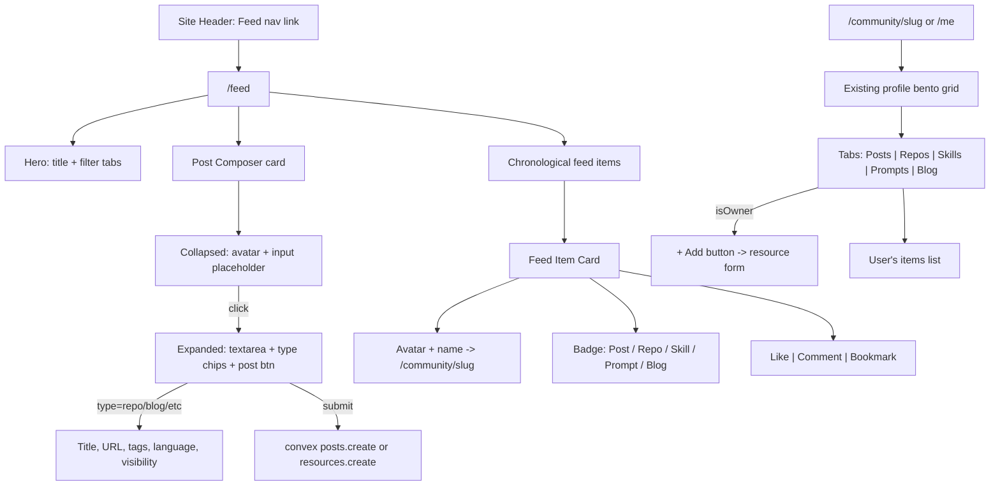

# Community Feed & User Resources

## Current State

- Single `profiles` table in Convex with slug/owner indexes
- `/feed` route is a WIP placeholder
- `/community/$slug` shows a profile bento grid (avatar, bio, chips)
- No content creation, no social interactions, no resource system
- Auth via Clerk + Convex, routing via TanStack Router, i18n ES/EN

## Data Model (Convex Schema)

Extend `convex/schema.ts` with these new tables:

### Resources table

Stores all user-created resources (repos, skills, prompts, blog entries):

```typescript
resources: defineTable({
  ownerId: v.string(),        // Clerk user ID
  type: v.union(
    v.literal("repo"),
    v.literal("skill"),
    v.literal("prompt"),
    v.literal("blog")
  ),
  title: v.string(),
  body: v.string(),           // Markdown content
  url: v.optional(v.string()),// External link (repos, etc.)
  tags: v.optional(v.array(v.string())),
  language: v.optional(v.string()), // For repos/prompts
  visibility: v.union(v.literal("public"), v.literal("members")),
  createdAt: v.number(),
  updatedAt: v.number(),
})
  .index("by_owner", ["ownerId"])
  .index("by_type", ["type", "createdAt"])
  .index("by_created", ["createdAt"])
```

### Posts table

Community posts (X/forum style, markdown):

```typescript
posts: defineTable({
  ownerId: v.string(),
  body: v.string(),            // Markdown
  createdAt: v.number(),
  updatedAt: v.number(),
})
  .index("by_owner", ["ownerId"])
  .index("by_created", ["createdAt"])
```

### Likes table

```typescript
likes: defineTable({
  userId: v.string(),
  targetId: v.id("posts"),     // or v.union for resources later
  targetType: v.union(v.literal("post"), v.literal("resource")),
  createdAt: v.number(),
})
  .index("by_target", ["targetType", "targetId"])
  .index("by_user_target", ["userId", "targetType", "targetId"])
```

### Comments table

```typescript
comments: defineTable({
  ownerId: v.string(),
  targetId: v.string(),        // post or resource ID
  targetType: v.union(v.literal("post"), v.literal("resource")),
  parentId: v.optional(v.id("comments")), // threaded replies
  body: v.string(),
  createdAt: v.number(),
})
  .index("by_target", ["targetType", "targetId", "createdAt"])
  .index("by_owner", ["ownerId"])
```

### Bookmarks table

```typescript
bookmarks: defineTable({
  userId: v.string(),
  targetId: v.string(),
  targetType: v.union(v.literal("post"), v.literal("resource")),
  createdAt: v.number(),
})
  .index("by_user", ["userId", "createdAt"])
  .index("by_user_target", ["userId", "targetType", "targetId"])
```

## Backend Functions (`convex/`)

### New files:

- [convex/resources.ts](convex/resources.ts) -- CRUD for resources (create, update, delete, listByOwner, getById, listAll with pagination)
- [convex/posts.ts](convex/posts.ts) -- CRUD for posts (create, update, delete, feed query with pagination)
- [convex/interactions.ts](convex/interactions.ts) -- Likes, comments, bookmarks (toggle like, add/delete comment, toggle bookmark, counts)
- [convex/feed.ts](convex/feed.ts) -- Unified feed query that merges posts + resources chronologically, paginated, with author profile data joined

### Feed query strategy:

- Query `posts` and `resources` separately by `createdAt` descending
- Merge and sort client-side or use a denormalized `feedItems` table for performance (start simple, optimize later)
- Each feed item includes: author profile (name, slug, avatar), content preview, interaction counts (likes, comments), user's own like/bookmark state

## Frontend Architecture

### Design pattern reference

All forms follow the **onboarding wizard** pattern from [src/components/onboarding/onboarding-wizard.tsx](src/components/onboarding/onboarding-wizard.tsx):

- Card with `rounded-2xl border border-border/60 bg-card p-6 shadow-lg` styling
- TanStack Form + Zod validation
- Custom hook (`useOnboardingWizard`-style) managing state
- `Field`, `FieldLabel`, `FieldError`, `FieldGroup` from `src/components/ui/field.tsx`
- `Input`, `Textarea`, `Select`, `ToggleChip` from existing UI kit
- `Tabs` component (`src/components/ui/tabs.tsx`) with `line` variant for content tabs

---

### A. Feed page (`/feed`) -- the social hub

This is the main community surface. Layout (top to bottom):

**1. Feed hero header** -- sticky-ish section below the site header:

- Left: Page title ("Community Feed" / "Feed de la Comunidad")
- Right: Filter tabs using the `Tabs` component (`line` variant): **All** | **Posts** | **Repos** | **Skills** | **Prompts** | **Blog**
- These are URL search params (`?tab=posts`) so they're linkable

**2. Post composer (inline, always visible for authenticated users):**

- Lives at the top of the feed, inside a card matching `CARD_BASE` style
- Collapsed state: author avatar (left) + a single-line `Input` placeholder ("What's on your mind?" / "Comparte algo con la comunidad...") that expands on click
- Expanded state: a `Textarea` with markdown support (plain textarea, no WYSIWYG), a toolbar row below with:
  - **Type selector**: pill/chip toggle for `post` (default), or quick-add `repo` / `skill` / `prompt` / `blog` -- switching type reveals extra fields inline
  - **Post button** (primary, right-aligned)
- When type is `repo` / `skill` / `prompt` / `blog`, additional fields slide in below the textarea:
  - `title` (Input, required)
  - `url` (Input, optional -- for repos/external links)
  - `tags` (comma-separated Input or ToggleChip selector)
  - `language` (Input, optional -- for repos/prompts)
  - `visibility` toggle: Public / Members-only
- This is a single component: `src/components/feed/post-composer.tsx`
- Hook: `src/components/feed/use-post-composer.ts` (TanStack Form + Zod, mutation calls)
- Unauthenticated users see a CTA card instead: "Join the community to share" with sign-in button

**3. Feed list (infinite scroll):**

- Each item is a `src/components/feed/feed-item.tsx` card:
  - **Header row**: author avatar (links to `/community/$slug`) + author name + timestamp (relative, e.g. "2h ago")
  - **Type badge**: small `Badge` component showing "Post", "Repo", "Skill", "Prompt", or "Blog" with the existing badge variants
  - **Content**: for posts, the full markdown body rendered; for resources, the title (bold) + body preview (3 lines, truncated) + tags as `DisplayChip`s + URL link if present
  - **Interaction bar** at bottom: `src/components/feed/interaction-bar.tsx` -- three icon buttons in a row: Like (heart + count), Comment (bubble + count), Bookmark (flag, toggles fill)
- Clicking a feed item navigates to a detail view or expands inline (start with expand inline, iterate later)
- Paginated via Convex `.paginate()` with "Load more" button at bottom (not infinite scroll initially -- simpler)

```
+------------------------------------------------------------------+
|  Community Feed                   [All] [Posts] [Repos] [Blog]   |
+------------------------------------------------------------------+
|  +------------------------------------------------------------+  |
|  | [avatar]  What's on your mind?              [Post ▾] [Send] | |
|  +------------------------------------------------------------+  |
|                                                                   |
|  +------------------------------------------------------------+  |
|  | [avatar] Walter Morales · 2h ago          [Badge: Post]     | |
|  |                                                              | |
|  | Just shipped our new community feed! Check it out...        | |
|  |                                                              | |
|  | ♡ 12    💬 3    🔖                                          | |
|  +------------------------------------------------------------+  |
|                                                                   |
|  +------------------------------------------------------------+  |
|  | [avatar] Ana García · 5h ago              [Badge: Repo]     | |
|  |                                                              | |
|  | **cursor-rules-collection**                                 | |
|  | A curated set of .cursorrules for SV devs...                | |
|  | [TypeScript] [cursor] [ai]                                  | |
|  | github.com/ana/cursor-rules                                 | |
|  |                                                              | |
|  | ♡ 8    💬 1    🔖                                           | |
|  +------------------------------------------------------------+  |
|                                                                   |
|  [Load more]                                                      |
+------------------------------------------------------------------+
```

---

### B. Profile resources tab (`/community/$slug` and `/me`)

Below the existing bento grid in [src/components/profile/profile-view.tsx](src/components/profile/profile-view.tsx), add a tabbed resources section:

**Layout:**

- `Tabs` component (`line` variant) with tabs: **Posts** | **Repos** | **Skills** | **Prompts** | **Blog**
- Each tab content is a vertical list of that user's items (same `feed-item.tsx` card, but without the author header since we're already on their profile)
- When `isOwner === true`, each tab shows a "+ Add" button at the top that opens the resource form inline or in a modal

**Resource form (for profile owners):**

- Reuses the same `post-composer.tsx` component but pre-set to the selected type
- Alternatively, a dedicated `src/components/resources/resource-form.tsx` that follows the wizard card style:
  - `title` (Input, required)
  - `body` (Textarea, markdown)
  - `url` (Input, optional)
  - `tags` (ToggleChip multi-select or comma input)
  - `language` (Input, optional)
  - `visibility` (toggle)
  - Save / Cancel buttons
- Hook: `src/components/resources/use-resource-form.ts`

**On `/me`:** same as `/community/$slug` but `isOwner=true` so the "+ Add" buttons and edit/delete actions are visible.

---

### C. Header navigation update

Update [src/components/site-header.tsx](src/components/site-header.tsx):

- Replace the "Blog" nav link with **"Feed"** pointing to `/feed`
- This makes the community feed a first-class navigation item
- The feed becomes the blog replacement -- blog entries are just a resource type within the feed

---

### D. Component inventory

New files to create:


| Component          | Path                                            | Purpose                                                                          |
| ------------------ | ----------------------------------------------- | -------------------------------------------------------------------------------- |
| Feed page          | `src/components/feed/feed-page.tsx`             | Main feed layout with hero header, composer, list                                |
| Post composer      | `src/components/feed/post-composer.tsx`         | Inline card: collapsed input -> expanded textarea + type selector + extra fields |
| Post composer hook | `src/components/feed/use-post-composer.ts`      | TanStack Form + Zod, handles create post/resource mutation                       |
| Feed item          | `src/components/feed/feed-item.tsx`             | Card displaying a post or resource with author info                              |
| Interaction bar    | `src/components/feed/interaction-bar.tsx`       | Like/comment/bookmark icon buttons with counts                                   |
| Comment thread     | `src/components/feed/comment-thread.tsx`        | Threaded comments list + reply form                                              |
| Resource form      | `src/components/resources/resource-form.tsx`    | Wizard-card-style form for adding/editing resources from profile                 |
| Resource form hook | `src/components/resources/use-resource-form.ts` | TanStack Form + Zod for resource CRUD                                            |
| Profile resources  | `src/components/profile/profile-resources.tsx`  | Tabbed resources section added below bento grid                                  |


---

### E. UX flow diagram




## i18n

Add content keys to [src/content/site-content.ts](src/content/site-content.ts) for both `es` and `en`:

- Feed page labels (filters, empty states, composer placeholder)
- Resource labels (type names, form fields, empty states)
- Interaction labels (like, comment, bookmark, reply)

## Implementation Order

The work is grouped into 4 phases to ship incrementally:

**Phase 1 -- Schema + Backend:** Add all new tables and backend functions. Deploy schema.

**Phase 2 -- Resources on Profiles:** Build resource CRUD, resource cards, and tabs on the profile page. This is self-contained and shippable.

**Phase 3 -- Posts + Feed:** Build the post composer, feed page, and feed query. Wire up the unified chronological feed with filter tabs.

**Phase 4 -- Social Interactions:** Add likes, comments, bookmarks. Wire interaction bar to feed items and resource cards. Add comment threads.