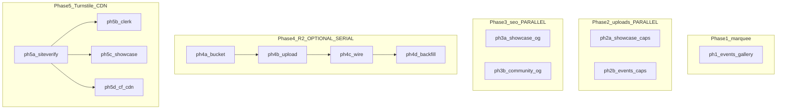

# Convex file bandwidth — prioritized plan

(Synced with `~/.cursor/plans/convex_bandwidth_investigation_94359935.plan.md`.)

## Phased execution (handoff)

**Legend:** `SERIAL` = must finish before listed dependents. `PARALLEL` = safe for different engineers/agents simultaneously (no conflicting files if split as noted).

_No edges between phase groups—dependencies are in the table below (Phases 2–5 are independent of each other except internal serial chains)._

**Parallelization notes (intentional looseness):**

| Phase | Items | Parallel? | Notes |
| --- | --- | --- | --- |
| **1** | `ph1-marquee-events-gallery` | **SERIAL** recommended first | Highest bandwidth win for duplicate `[...past,...past]`. **Phase 2 can run in parallel** with Phase 1 (disjoint files)—assign different agents if needed. |
| **2** | `ph2a` + `ph2b` | **PARALLEL** | Different surfaces (showcase vs admin events). No file overlap. |
| **3** | `ph3a` + `ph3b` | **PARALLEL** | `ph3b` optional if community SEO does not pass Convex images. |
| **4** | `ph4a`→`ph4b`→`ph4c`→`ph4d` | **SERIAL chain** | R2 migration order. `ph4d` can be a **separate backfill agent** after `ph4c`. |
| **5** | `ph5a` then `ph5b`/`ph5c`/`ph5d` | **After `ph5a`:** `ph5b`, `ph5c`, `ph5d` **PARALLEL** | Shared `siteverify` first; then auth UI, showcase submit, and CDN ops can split across people. `ph5d` is **ops/DNS**—can overlap with `ph5b` once proxy plan is agreed. |

**Cross-phase parallelism:** Phase **5** (Turnstile/CDN) is **independent** of Phases **2–3** (can start `ph5a` after env keys exist). Phase **4** (R2) is **independent** of Phase **5**. Phase **4** benefits from Phase **3** SEO being done so OG no longer points at huge Convex URLs, but R2 can proceed regardless.

## Priority order (summary)

| Priority | Item | Notes |
| --- | --- | --- |
| **P0** | CSS marquee / repeat | **Must:** Remove duplicate React list so each storage URL is requested **once** per homepage visit; implement seamless strip with CSS (e.g. animated duplicate **track** without doubling `` network dedupe—or single row + CSS `animation` on a duplicated **visual** layer that reuses same `src`). Files: [`src/components/sections/events-section.tsx`](src/components/sections/events-section.tsx). |
| **P1** | Upload limits + compression | Cap bytes and dimensions for event covers ([`admin-event-form`](src/components/admin/admin-event-form.tsx) / backend) and showcase ([`showcase-cover-upload.tsx`](src/components/showcase/showcase-cover-upload.tsx)); align with existing hints. |
| **P2** | Fixed OG image | Use **`og.png`** (site default) for Open Graph / Twitter image on showcase (and community slug pages if they currently pass Convex URLs). Update [`convex/showcase.ts`](convex/showcase.ts) `getShowcaseSeoBySlug` to **not** set `imageUrl` to `entry.coverImageUrl`, and let [`buildSeoMeta`](src/lib/seo-meta.ts) fall through to `defaultOgImageUrl()` → `/og.png`, **or** pass explicit `${origin}/og.png`. Reduces crawler-driven full-size cover downloads. |
| **P3** | **Cloudflare R2** (optional) | Only if bandwidth/cost remains high after P0–P2. **Target:** R2 for hot public images—**$0 egress** to Internet, low $/GB-month storage, S3-compatible API usable from **Vercel** (no requirement to move the TanStack Start app to Cloudflare). Optional later: Workers + R2 bindings if you want tighter integration. |

**Discarded:** Mapping largest `_storage` IDs to events vs showcase in admin (no longer in scope).

---

## P3: Convex file serving vs Cloudflare R2

Figures are **indicative**—confirm on [Cloudflare R2 pricing](https://developers.cloudflare.com/r2/pricing/) and [Convex pricing](https://www.convex.dev/pricing) before implementation.

| | **Convex `_storage`** (today) | **Cloudflare R2** (planned P3 target) |
| --- | --- | --- |
| **Role** | DB-adjacent uploads; `getUrl` for reads | Object storage; public bucket URL or custom domain |
| **Storage** | Included in Convex plan | ~**$0.015/GB-mo** standard class |
| **Bandwidth / egress** | Convex **file bandwidth** meter (~**$0.33/GB** overage typical; includes free tier) | **$0** egress to Internet |
| **Reads** | Via Convex URL | Class B **~$0.36/million** reads (S3 API); often negligible |
| **Integration** | Native Convex | AWS SDK + R2 endpoint from Vercel routes or Convex **action**; store final URL in Convex documents |

**Note:** Hosting the app on **Vercel** + **R2** is fine; moving the app to **Cloudflare Workers** is optional and only for tighter R2 bindings (not required for R2 adoption).

---

## Investigation summary (unchanged facts)

- **Bandwidth ≠ storage:** 8 GB served is cumulative **bytes transferred**, not total stored size.
- **Homepage events** were the worst offender pattern: duplicated past array → **2×** downloads per cover; large JPEGs amplify this.
- **Showcase** + **OG** using full `coverImageUrl` drives crawler/social fetches — **P2** fixes that by fixing **`og.png`**.

---

## Optional Cloudflare follow-ons (separate from P0–P3)

**Only these two** are in scope for future Cloudflare work (not WAF-only, analytics, email, etc.):

| Item | Scope |
| --- | --- |
| **Turnstile** | **Sign-in / sign-up:** widget + [`siteverify`](https://developers.cloudflare.com/turnstile/get-started/server-side-validation/) before or alongside Clerk on [`sign-in`](src/routes/sign-in.tsx) / [`sign-up`](src/routes/sign-up.tsx). **Showcase submit:** require token before [`showcase` create](convex/showcase.ts) (Convex action or HTTP verifies token). |
| **CDN** | **Orange-cloud** proxy for the production hostname in front of Vercel; **Cache Rules** (or **Cache Everything** selectively) for **immutable** assets—hashed JS/CSS from build, long TTL for `public/` paths where safe; avoid caching HTML/API responses aggressively unless you know the cache key story. |

**Turnstile sketch:** widget → `cf-turnstile-response` → POST `https://challenges.cloudflare.com/turnstile/v0/siteverify` with **secret** → on success, proceed to Clerk or Convex. Secrets only in Vercel/Convex env.

---

## Cloudflare skill verification

Cross-checked against the installed **Cloudflare** plugin skill (`skills/cloudflare` → `references/turnstile/`, `references/r2/`). Summary:

### Turnstile — plan is valid; add these at implementation time

| Skill rule | Implication |
| --- | --- |
| **Server-side validation required** | Never call `siteverify` from the browser; only Vercel route / Convex **action** / `httpAction` with **secret** env. Matches plan. |
| **Token lifetime ~5 minutes; single-use** | Each showcase submit / login attempt needs a **fresh** token; do not reuse the same token for multiple Convex calls (avoid `timeout-or-duplicate`). Reset widget on failed submit. |
| **`siteverify` body** | JSON: `secret`, `response` (token), optional **`remoteip`** (use client IP from `CF-Connecting-IP` if request hits Cloudflare first, else `X-Forwarded-For` / platform-provided IP on Vercel). |
| **CSP** | Allow `https://challenges.cloudflare.com` in **`script-src`** and **`frame-src`** (skill gotchas). |
| **React / SPA** | Avoid orphaned widgets on navigation; handle **StrictMode** double-mount with cleanup (`turnstile.remove`); use test **site/secret keys** in dev ([Turnstile testing keys](https://developers.cloudflare.com/turnstile/troubleshooting/testing/)). |

### R2 (P3) — plan is valid

| Skill rule | Implication |
| --- | --- |
| **Zero egress; S3-compatible** | Aligns with P3 cost story. |
| **Uploads from app not on Workers** | Use **S3 API** (presigned `PUT`) or server upload from Vercel/Convex — matches Cloudflare R2 docs on presigned URLs ([R2](https://developers.cloudflare.com/r2/)). |
| **Public reads** | Custom domain or `r2.dev` public URL; configure **CORS** if browser uploads directly to R2. |
| **Workers bindings** | Skill prefers **R2 bindings** inside Workers vs REST from Worker; optional for us because the app stays on **Vercel** — REST/SDK from Node is the expected path. |

### CDN (orange cloud + Vercel)

| Note | Detail |
| --- | --- |
| **Not Workers-specific** | The skill’s CDN examples focus on **Cache API** inside Workers; our item is **DNS proxy + Cache Rules** in front of Vercel. Follow [Cloudflare proxy / SSL](https://developers.cloudflare.com/fundamentals/concepts/how-cloudflare-works/) and keep **HTML/API uncached** unless you deliberately design cache keys (plan already warns). |

---

## References

- Events query: [`convex/events.ts`](convex/events.ts) `listForHomepage`
- Events UI: [`src/components/sections/events-section.tsx`](src/components/sections/events-section.tsx)
- Showcase SEO: [`convex/showcase.ts`](convex/showcase.ts) `getShowcaseSeoBySlug`
- Meta builder: [`src/lib/seo-meta.ts`](src/lib/seo-meta.ts)
