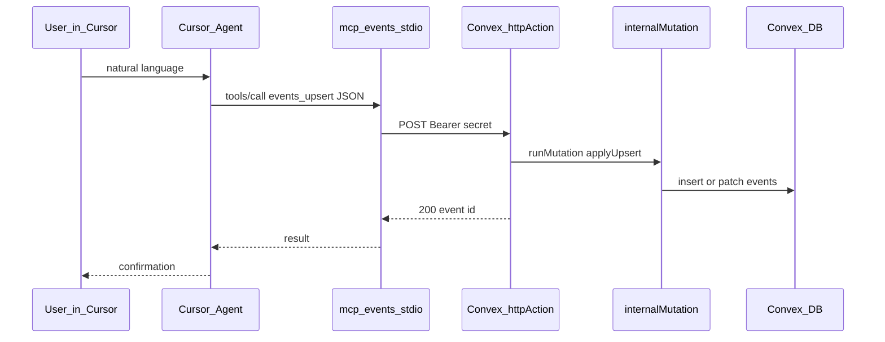

# Build plan: Conversational events MCP (Cursor)

## Goal

**In Cursor chat**, you describe an event (or iterate on fields); the agent calls MCP tools that **create or update** Convex `events` rows **the same way** the admin form does ([`AdminEventForm`](src/components/admin/admin-event-form.tsx) → [`api.admin.upsertEvent`](convex/admin.ts)).

This is an **internal team** workflow. The secret must never ship to the browser.

## Why a custom MCP (not Convex’s `mcp start` alone)

The official Convex MCP [`run`](https://docs.convex.dev/ai/convex-mcp-server) tool invokes functions **without** a Clerk JWT. Your [`upsertEvent`](convex/admin.ts) requires `ctx.auth.getUserIdentity()` + [`isAdmin`](convex/lib/admin.ts) → **always fails** for automation unless you add a separate machine path.

## Target architecture



**Decision (locked for v1):** HTTP `httpAction` + `internalMutation` + **Bearer** `ADMIN_MCP_SECRET`. Skip the “public mutation + apiKey in args” shortcut unless you need to ship faster with higher risk.

---

## Phase 1 — Convex

### 1.1 Shared upsert logic

- **New file:** [`convex/lib/upsert-event-body.ts`](convex/lib/upsert-event-body.ts) (or keep name aligned with repo conventions).
- **Contents:** A single function, e.g. `applyEventUpsert(ctx, args)`, that contains the **exact** field mapping now inline in [`upsertEvent`](convex/admin.ts) (lines 83–117): `eventData`, `createdAt` preservation on patch, `insert` vs `patch`.
- **Refactor:** [`convex/admin.ts`](convex/admin.ts) `upsertEvent` handler: after Clerk + `isAdmin`, call the shared helper only.

### 1.2 Internal mutation (no Clerk)

- **New file:** [`convex/events-mcp-internal.ts`](convex/events-mcp-internal.ts) (kebab-case file name).
- **`internalMutation`** `applyUpsert` with the **same `args` validator** as `upsertEvent` (copy the `v` object from admin or import a shared `upsertEventArgs` constant if you dedupe validators).
- Handler: call `applyEventUpsert` only — **no** `getUserIdentity`.

### 1.3 HTTP route

- **Edit:** [`convex/http.ts`](convex/http.ts) — today it only exports an empty router.
- **`httpAction`** on **`POST /api/mcp/events`** (prefix `/api/mcp` keeps it obvious in logs; adjust if you prefer `/admin/mcp/events`).
- **Auth:** Read `Authorization` header; require `Bearer <token>` where `<token>` === `process.env.ADMIN_MCP_SECRET`. Missing/wrong → **401** plain text.
- **Body:** `Content-Type: application/json`. Parse JSON; on bad JSON → **400**.
- **Success:** `ctx.runMutation(internal.eventsMcpInternal.applyUpsert, parsed)` — use the actual generated `internal` path after codegen.
- **Response:** JSON `{ "id": "<id>" }` with appropriate status **200**; surface Convex errors as **500** with a short message (no stack to client).

### 1.4 Optional v1 tool: list

- Add **`internalQuery`** or **`internalMutation`** that returns the same shape as [`listEvents`](convex/admin.ts) **without** auth, **only** callable from HTTP — or expose a read-only **`GET /api/mcp/events`** that uses `ctx.runQuery(internal...)` mirroring admin sort (startAt desc).
- If time-boxed: **skip GET** in v1 and only ship `events_upsert`; the agent can use the existing Convex MCP `data` on `events` for read-only inspection (read-only, separate from this plan).

**Acceptance — Phase 1**

- [ ] `upsertEvent` from the admin UI still works unchanged (manual smoke).
- [ ] `curl` with correct Bearer creates a draft event; wrong Bearer returns 401.
- [ ] Secret exists only in Convex env, not in `VITE_*` or client bundles.

---

## Phase 2 — MCP server (Node, stdio)

### 2.1 Location and runtime

- **Preferred:** [`scripts/mcp-events-server.ts`](scripts/mcp-events-server.ts) run with `pnpm exec tsx` or compile with `tsc` — match how the repo runs other scripts (inspect [`package.json`](package.json)).
- **Alternative:** `packages/mcp-events/` as a tiny workspace package if you want isolation.

### 2.2 Dependencies

- Add **`@modelcontextprotocol/sdk`** to `package.json` devDependencies (or dependencies) if not already a direct dependency (lockfile may list it transitively only — make it direct for clarity).

### 2.3 Environment (MCP process only)

| Variable | Purpose |
|----------|---------|
| `CONVEX_URL` | Deployment URL used for **HTTP** routes. Convex HTTP actions are served from the deployment; use the same base you use for API (see [Convex HTTP routing](https://docs.convex.dev/functions/http-actions)). Often `https://<deployment>.convex.site` — **verify** against your dashboard for this project. |
| `ADMIN_MCP_SECRET` | Same value as Convex `ADMIN_MCP_SECRET`. |

Document in `.env.example` as **server/MCP only**, never prefixed with `VITE_`.

### 2.4 Tools (minimal, buildable)

Use **string parameters** for JSON payloads (Cursor MCP compatibility per [Convex Stack note](https://stack.convex.dev/convex-mcp-server)).

| Tool name | Description |
|-----------|-------------|
| `events_upsert` | Required: string `payload` = JSON matching Convex `upsertEvent` args (omit `id` to create). Tool description must list required fields: `slug`, `published`, `type`, `tags`, `startAt` (number ms UTC), `title`/`description`/`location`/`dateLabel` `{ es, en }`, `rsvpUrl`, optional fields from schema. |
| `events_list` | *(Optional v1)* No args or empty object — `GET` if you implemented it. |

**Conversational hint in tool description:** Tell the model that `startAt`/`endAt` are **Unix ms in UTC**; if the user says “March 5 7pm San Salvador”, the agent must convert to UTC before calling (same semantics as [`svLocalToUtc`](src/components/admin/admin-event-form.tsx) / `America/El_Salvador`).

### 2.5 Implementation sketch

- `Server` from SDK, `stdio` transport.
- On `events_upsert`: `JSON.parse(payload)` → `fetch(`${CONVEX_URL}/api/mcp/events`, { method: 'POST', headers: { Authorization: `Bearer ${secret}`, 'Content-Type': 'application/json' }, body: payload })` → return text/JSON result to the model.

**Acceptance — Phase 2**

- [ ] Running the server manually + MCP inspector (if used) shows tools.
- [ ] From Cursor, a test prompt (“create draft event with …”) results in a tool call and a new row in `events`.

---

## Phase 3 — Cursor wiring

- **Edit:** [`.cursor/mcp.json`](.cursor/mcp.json) — add server e.g. `ailabs-events`:

```json
"ailabs-events": {
  "command": "pnpm",
  "args": ["exec", "tsx", "scripts/mcp-events-server.ts"],
  "env": {
    "CONVEX_URL": "https://YOUR_DEPLOYMENT.convex.site",
    "ADMIN_MCP_SECRET": "see-1password-or-local-env"
  }
}
```

(Adjust `command`/`args` to match final script location and runner.)

- **Docs:** Short paragraph in [`README.md`](README.md) or internal wiki: generate secret (`openssl rand -hex 32`), set in Convex dashboard + local env for MCP.

**Acceptance — Phase 3**

- [ ] MCP appears in Cursor and enables without errors.
- [ ] Team members know where to copy env values (not committed).

---

## Out of scope for v1

- Cover image / storage uploads via MCP.
- Publishing workflow polish (can still set `published: true` in JSON).
- Production vs dev deployment selector inside MCP (use separate `mcp.json` env blocks or two server entries if needed later).

## Security checklist

- [ ] `ADMIN_MCP_SECRET` is long random; rotated if leaked.
- [ ] Secret not in git; `.env.example` only has placeholder names.
- [ ] No new public **browser** API that bypasses Clerk for writes.

---

## Reference: `upsertEvent` field list

Align MCP JSON with [`convex/admin.ts`](convex/admin.ts) `upsertEvent` args: `id?`, `slug`, `published`, `type`, `tags`, `isVirtual?`, `partner?`, `country?`, `startAt`, `endAt?`, `timezone?`, `title`, `description`, `location`, `dateLabel`, `rsvpUrl`, `coverImageId?`, `imageUrl?`, `recapUrl?`, `photoAlbumUrl?`, `galleryDateLabel?`.

---

## Rollback

Remove HTTP route + internal file; delete MCP script; revert admin refactor only if helper is wrong — keep admin on shared helper once stable.
